# Quick Plugin Switcher (QPS)

This plugin simplifies the process of managing your plugins (demos at the end of this page)  

## Introduction:

This plugin is done around two windows:

- the main window give access to all installed plugins with many options 
- and the second window is an improved version of community plugins view with many options 

installed plugins
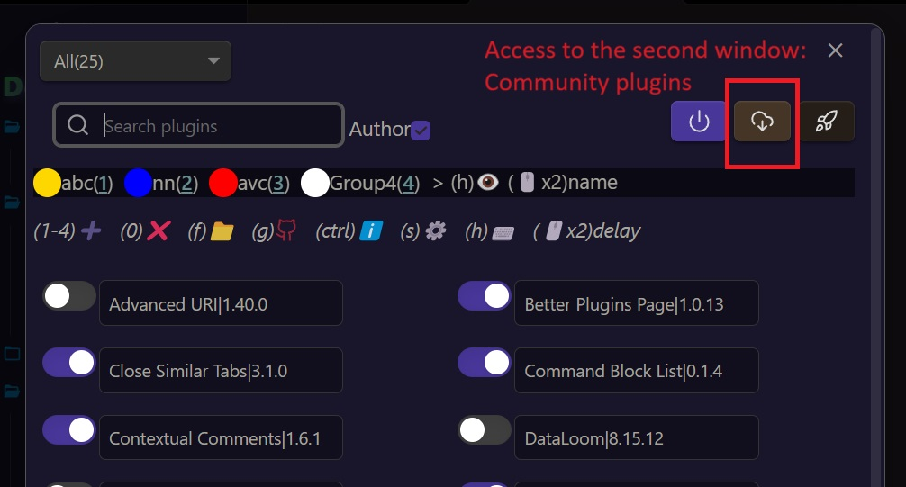
community plugins
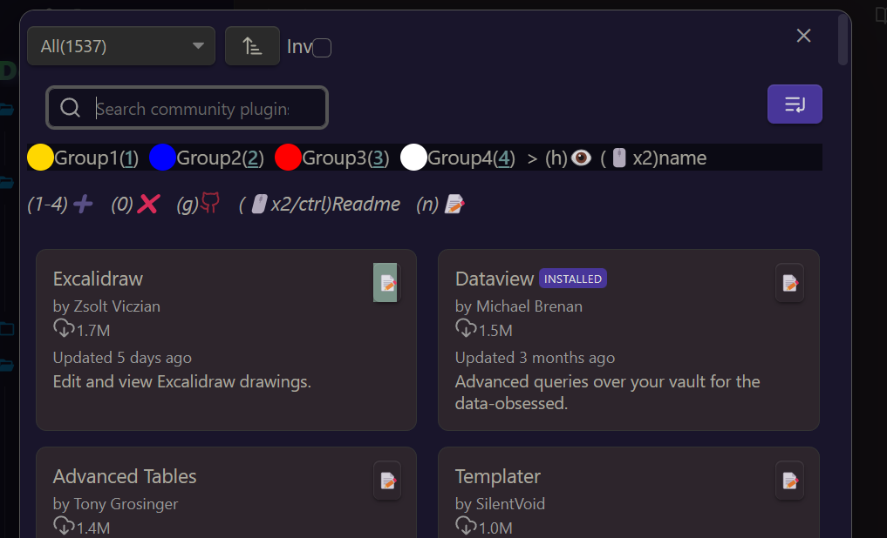

there are buttons, context menus, dropdown menus, search menus, and you can double click on some elements 

## Mainly, you can:

- quickly toggle enable/disable on plugins
- use groups for many operations
- add a delay at start
- enable/disable platform dependent mobile/desktop
- get quick accesses (github repo, plugin folder...)
- apply some filters search, hide groups...
- take some notes on community plugins
- tools to install plugins between vaults
- switch a plugin via command

## New: 

- see downloads stats for each community plugin using (s) or in the context menu on mobile.  Using this site [obsidian stats](https://www.moritzjung.dev/obsidian-stats)

- option in setting to keep last value in dropdown menus (true by default)
- switch a plugin via command. 

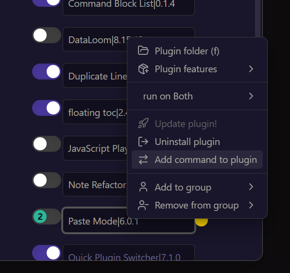
then in command palette  
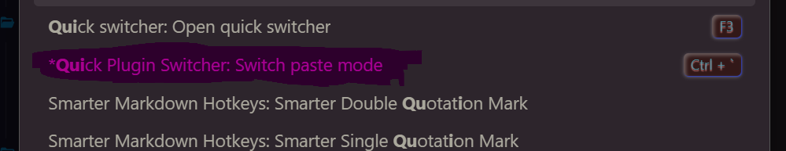

- add notes to community plugins 

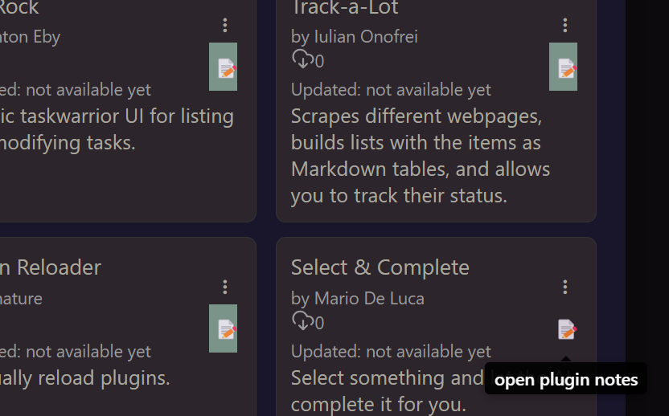
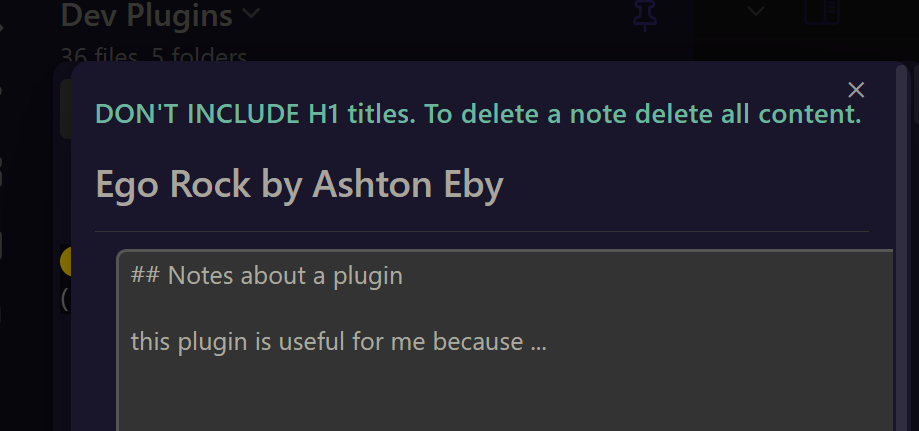  

- option to make a plugin platform dependant

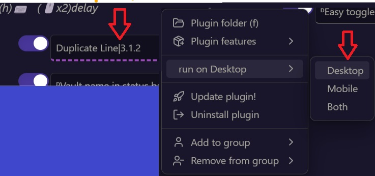
- plugin updates
- community plugins have been added and a lot of things fixed or improved

## Features

### general
- access QPS from ribbon bar or command 

### filters

you have now an option in plugin settings to keep previous filter value when re opening a window

- first window

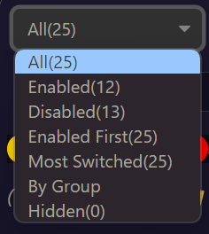  
filter By group
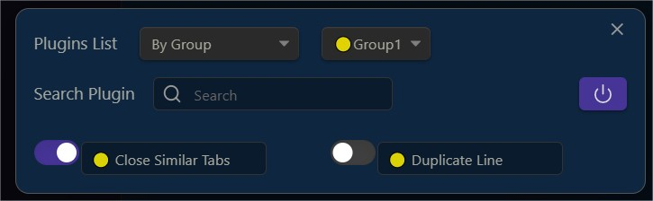
filter by Most Switched filter (most switched plugins)
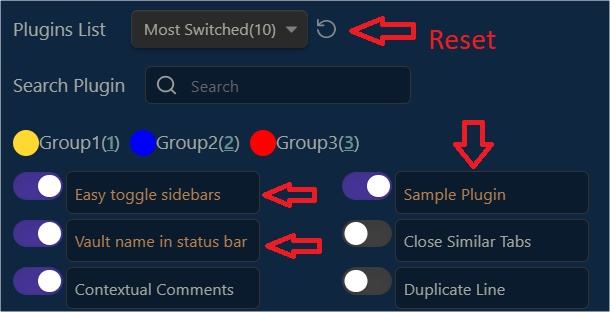

- second window

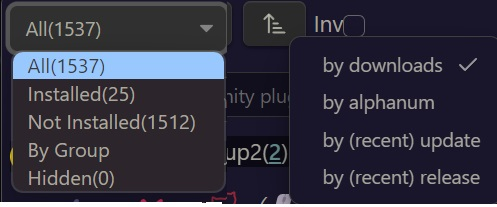

## search bar

- first window

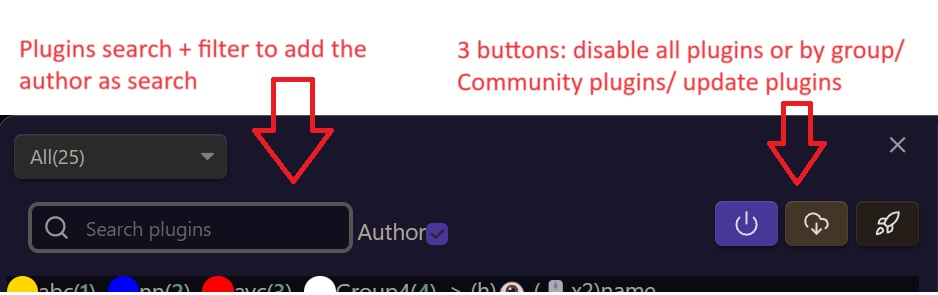
- second window

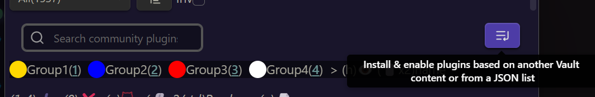
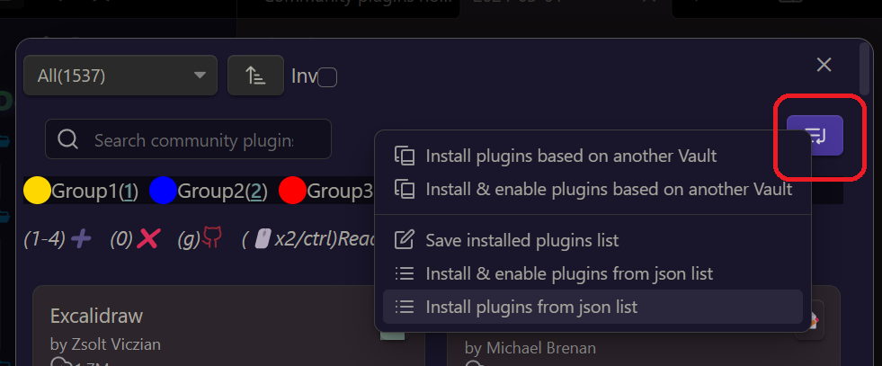
this button to do some additional things...

## floating groups bar
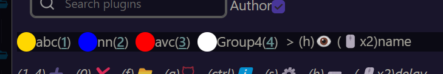

- you can **double click the name** to rename a group
- you can **double click the icon** (before name) to add a delay to a group (plugins in group delayed at start)
- you can hide a group, shortcut h, or in context menu
- you can open a **context menu** on group name

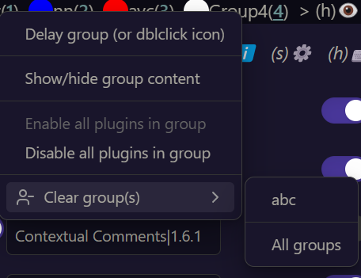
in community plugin the behaviour is the same with some different options

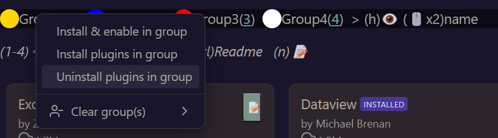

## shortcut bar

In the first window
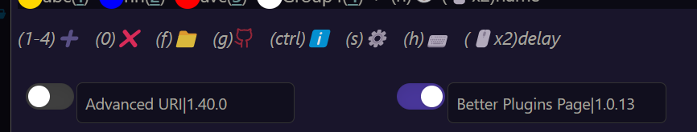
Shortcut that you can press over a plugin name:  
here we have 4 groups so we can press 1,2,3,4 over a plugin to add a group.  
0/del/suppr to delete group(s).   
f to open the plugin folder  
g to open the github repo
ctrl to open short plugin description  
s plugin settings  
h plugin hotkeys
double click to add a delay on start to a plugin.  

in commmunity plugins
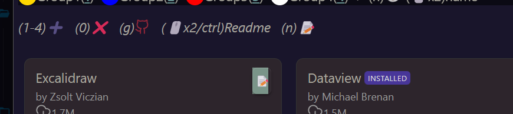
n to add a note of description. useful to remember things  
ctrl/dbl click to open the github readme.

## plugin items

First window
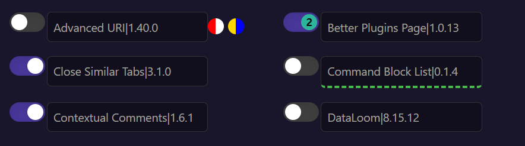
- we can see 4 groups added to the same plugin. 6 groups max are possible
- a delay at start of 2 seconds. double click on the plugin name. and same to disable the delay
- the green dashed line is on a plugin only enable on mobile platform. Useful when you share a vault on the cloud between different devices.
- desktop only plugins are marked with a ᴰ

-context menu
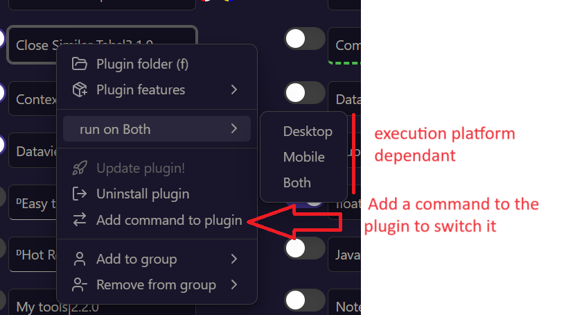

Second window
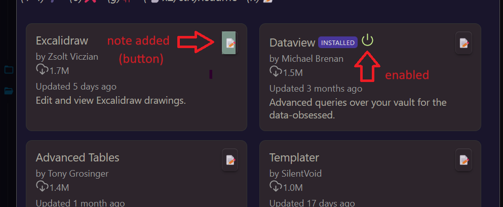
- the note button allow to create a note (then the button is green)
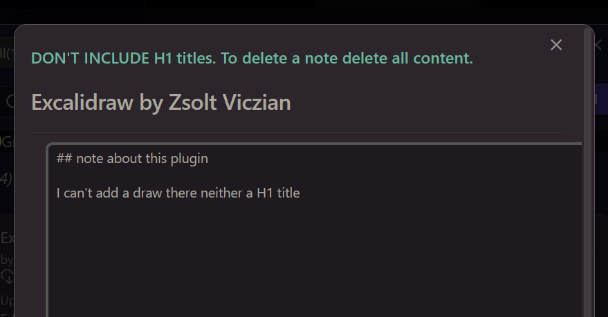
H1 are used to create each note in a same markdown file in your vault. You can choose the folder where this file will be in settings.
To delete a note, delete all its content.
- double clicking or pressing ctrl over a block will open the readme
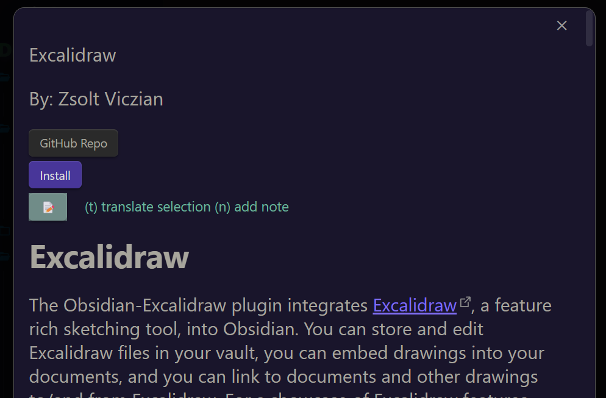
- context menu with install uninstall enable

## videos

-6- [youtube](https://youtu.be/-sPDQBTuEkc?si=uUKovOgOgnkdefyI) main presentation

-5- add command to plugin to quickly switch it

-4- shortcuts helper

-3- delay at start (feature request, inspired by "plugin groups")

update info will show only once

-2- groups
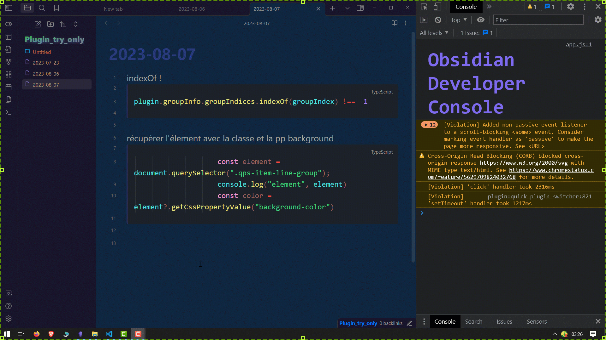

-1- first demo
  
